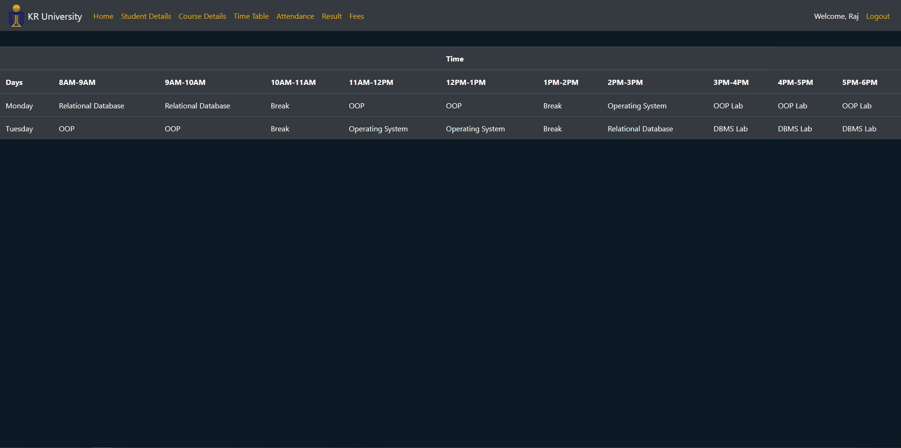
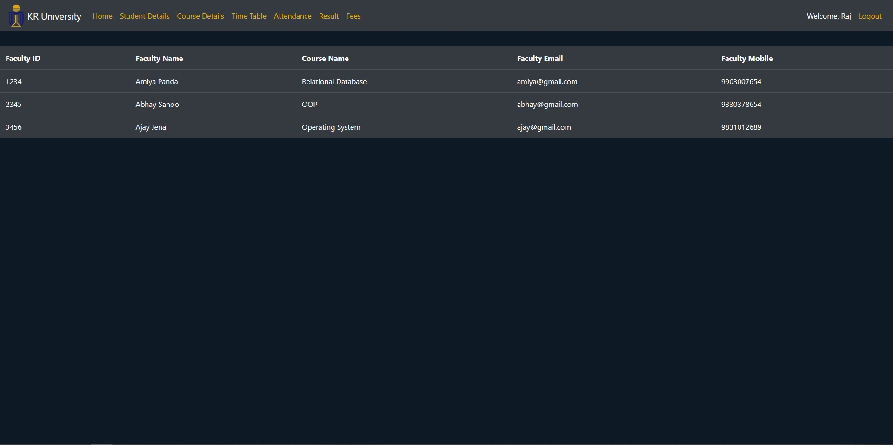
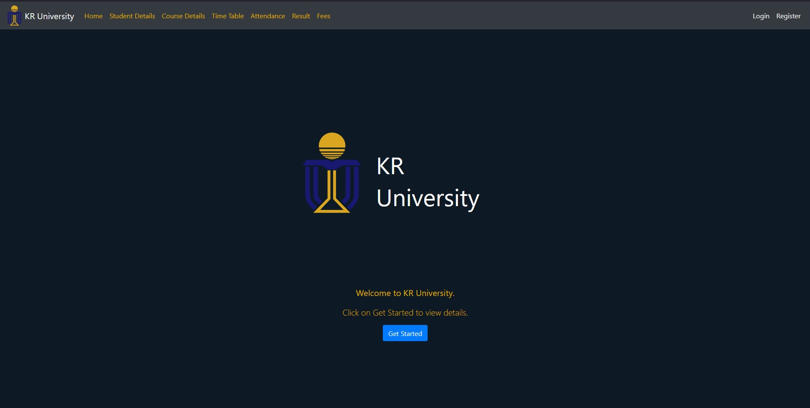
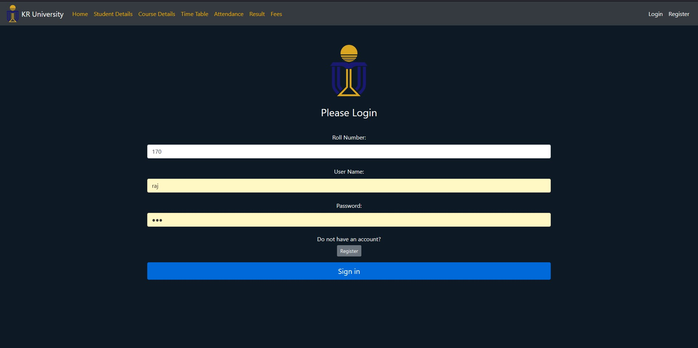

<h1 align="center"> University Website </h1>

<h2>Introduction:</h2>

- The script is divided into many parts
- First is the market application
	- It contains the database tables and renders the html templates
- Second is the routes
	- It contains the routes to the different webpages and creates teh different users
- Third is the forms
	- It contains registration and login forms  
- Fourth are the various html files like base, home page, login, details, register, attendance, courses, time table and fees 
		- The base file contains the base proforma of the website, which the rest of the webpages extends
		- The home file is used for designing the home page
		- The login file is used for designing the login page
		- The register file is used for designing the register page
		- The details file is used for showing the details of the student
		- The attendance file is used for showing the attendance of the student
		- The course file is used for showing the courses of the student
		- The time table is used for showing the courses of the student
		- The fees is used for showing the fees of the student
		
- The application file is used to run the entire program 

<h2>Third-Party Libraries Required:</h2>

- Flask
- SqlAlchemy

<h2>How to install the above Library:</h2>

- pip install Flask
- pip install SqlAlchemy

<h2>How to use:</h2>

- Need to install both SqlAlchemy and Flask through the terminal
- Then use set FLASK_APP=run
- flask run

## Output

<h2>Input</h2>

